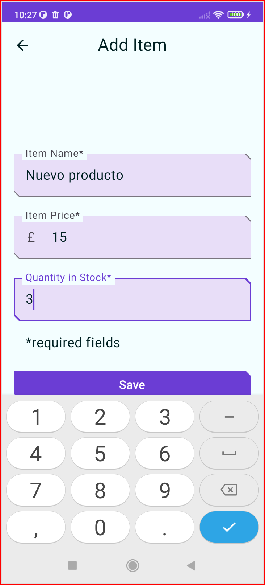
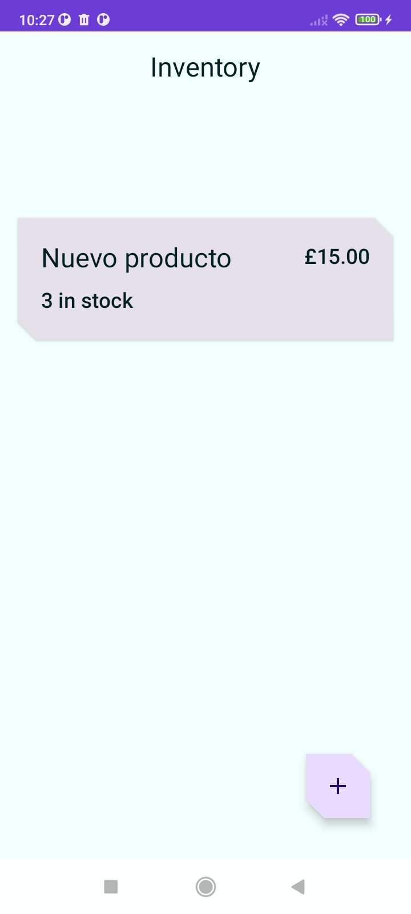
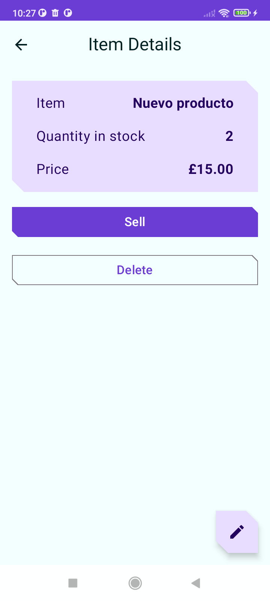
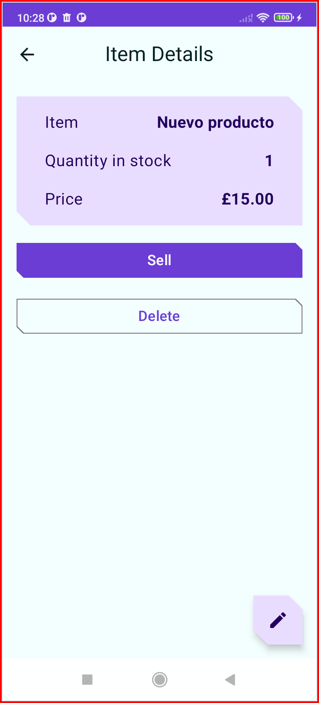
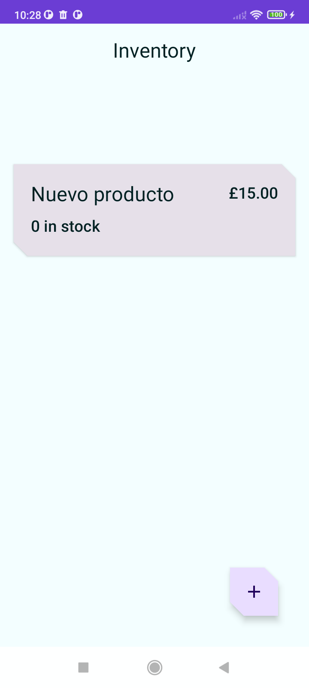
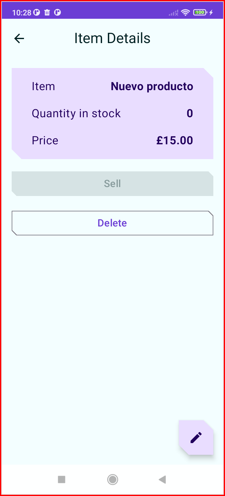
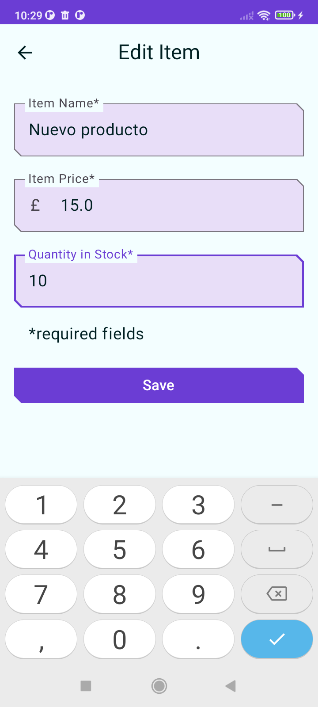
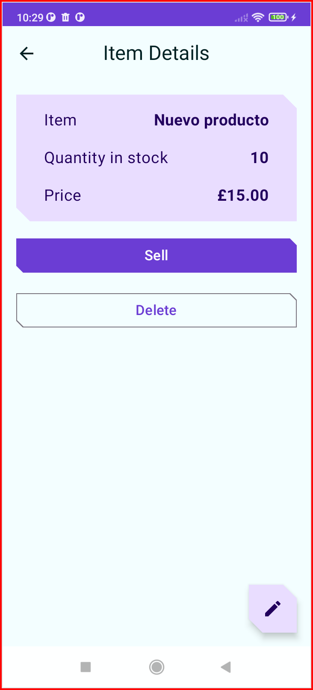
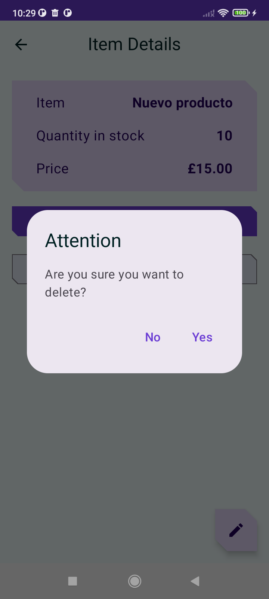
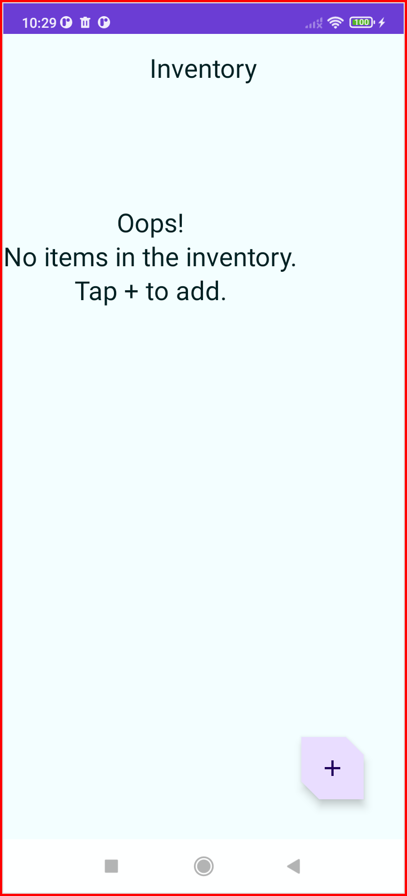

# UD3_01_Inventory - Aplicación de inventario 

Código de solución para Android kotlin Jetpack Compose.

## Introducción

Esta aplicación es una aplicación de seguimiento de inventario. Muestra cómo agregar, actualizar, vender y eliminar artículos de la base de datos local.
Esta aplicación muestra el uso de la base de datos gestionada por [Room](https://developer.android.com/training/data-storage/room).
La ​​aplicación también usa [ViewModel](https://developer.android.com/topic/libraries/architecture/viewmodel),
[Flow](https://developer.android.com/kotlin/flow)
y [Navigation](https://developer.android.com/topic/libraries/architecture/navigation/).

Codelab de persistencia de datos para room basado en https://developer.android.com/codelabs/basic-android-kotlin-compose-persisting-data-room

## Historico de commits
* xxxxxxx 📚 Documentacion: Terminado readme
* a225ad8 📸 Screenshots: Borde rojo en capturas
* 2312414 📸 Screenshots: Agregadas capturas
* 2476142 ✨ Cambio menor: 8. Elemento Sell (venta), edicion y borrado
* 26a8597 📚 Documentacion: Readme en castellano a falta de algunos detalles
* b767b24 ✨ Cambio menor: 6. Muestra los detalles del elemento
* a71929f ✨ Cambio menor: 5. Prueba tu base de datos
* 56b218d ✨ Cambio menor: 4. Muestra los datos de inventario
* 5a115aa ✨ Cambio menor: 3. Actualiza el estado de la IU
* 93c2afa 🚀 Cambio mayor: Nuevo codelab: Cómo leer y actualizar datos con Room
* aedc343 ✨ Cambios menores: Paso 9. Agrega la función de guardar
* 39ae408 ✨ Cambios menores: Paso 8,Implementa el repositorio
* 0e35f5f ✨ Cambios menores: Paso 7, Crea una instancia de base de datos
* 23b13ea ✨ Cambios menores: Paso 6, Creado DAO para los items
* f3159c3 ✨ Cambios menores: Paso 5, Creada clase @Entity para usar con los items
* 85f1ddb ✨ Cambios menores: Paso 4, agregada dependencia de Room
* 1ffb5a1 🎉 First commit!

# URL solución oficial:
https://github.com/google-developer-training/basic-android-kotlin-compose-training-inventory-app

## Caputras de pantalla

Iniciamos la app sin ningun item

Agregamos nuevo producto

Vemos el nuevo producto en el inventario

Vamos a los detalles del nuevo producto y vendemos uno

Vendemos otro producto

Cuando no quedan productos el boton de venta se desactiva

En el inventario se ha actualizado la cantidad

Pulsamos sobre el boton flotante de edicion de producto

Agregamos algunas unidades para tener stock y guardamos

Podemos ver el nuevo stock y pulsamos sobre el boton de eliminar producto

Confirmamos borrado

El producto desaparece del inventario

